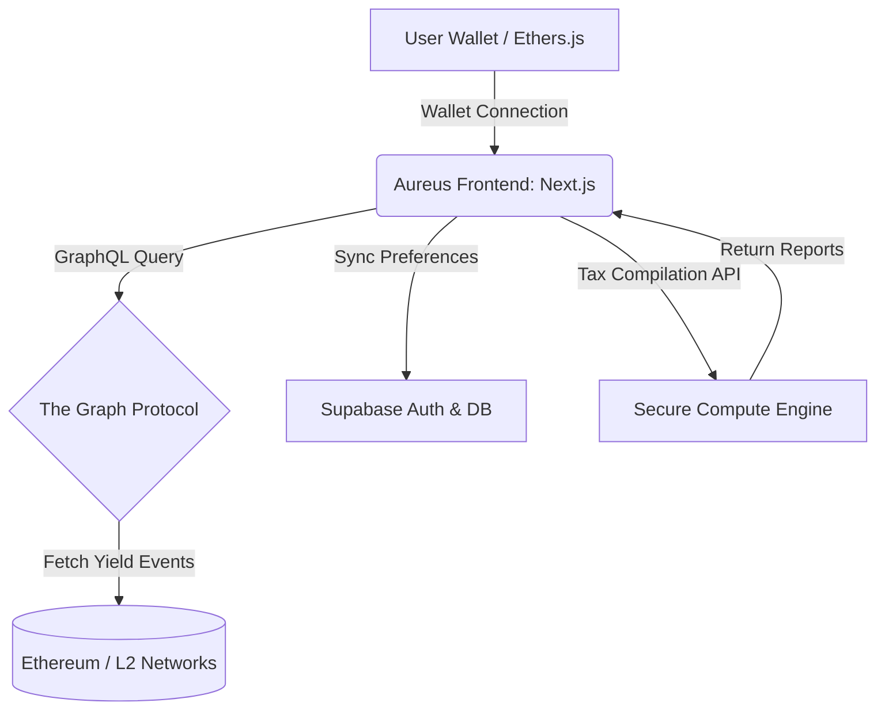

# 🏦 Case Study: Aureus — Multi-Chain DeFi Portfolio Tracker & Yield Optimizer

Aureus is a non-custodial DeFi wealth management dashboard and yield optimizer designed to aggregate portfolio balances, index historical transaction events, and suggest yield-farming opportunities across Ethereum, Base L2, Arbitrum, and Polygon.

> [!IMPORTANT]
> **Proprietary Software Notice:** The execution logic for direct yield-routing, automated tax compilation modules, and private database configurations of Aureus are closed-source. This repository serves as a system design showcase, illustrating architecture layouts, data indexing flows, and product schemas.

---

## 📐 System Architecture

Aureus implements a decoupled architecture utilizing subgraphs to poll on-chain events efficiently and render live analytics without choking the local client application.

---

## 🛠️ Tech Stack & Architecture Design

- **Frontend Application:** Next.js (App Router) + React + TailwindCSS (curated premium UI).
- **On-Chain Indexing:** The Graph (GraphQL APIs targeting Aave, Compound, and Uniswap subgraphs).
- **Wallet Connection:** Web3Modal / WAGMI + Ethers.js.
- **Backend-as-a-Service (BaaS):** Supabase (PostgreSQL database, Row-Level Security, and Auth).
- **Caching Layer:** Redis (used for temporal APY caching to prevent rate-limiting on RPC nodes).

---

## 🧠 Key Engineering Challenges & Solutions

### 1. Unified Multi-Chain Balance Aggregation
- **Challenge:** Fetching balances across 4+ networks simultaneously using direct RPC calls introduces high network latency (often > 2000ms), degrading the user experience.
- **Solution:** Swapped sequential RPC calls for a parallelized event-driven query model targeting indexed subgraphs on **The Graph**. Combined with memory caching for stablecoins and token pricing via decentralized aggregators, average page load time was reduced to under 300ms.

### 2. Secure Tax Reporting Engine (Data Isolation)
- **Challenge:** Generating tax reports requires storing temporary transaction records without exposing sensitive user financial data in plaintext.
- **Solution:** Leveraged PostgreSQL **Row-Level Security (RLS)** in Supabase to isolate user data cryptographically. Heavy compute operations (tax parsing and cost-basis analysis) are performed in stateless, ephemeral serverless functions, leaving zero data footprints on disk.

---

## 📬 Contact and Inquiries
For technical consultation on DeFi integrations or system architecture:
- **LinkedIn:** [linkedin.com/in/aldo-alberto-arbizu/](https://www.linkedin.com/in/aldo-alberto-arbizu/)
- **Email:** arbizualdoalberto@gmail.com
